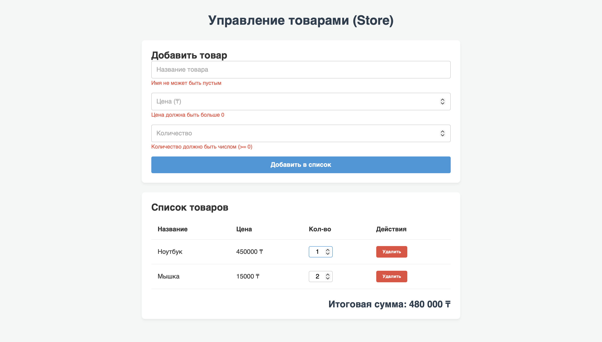

# Lab 5: DOM, События, Формы

**Автор:** Максат Сатауов

## 1. Как открыть проект
Вы можете открыть локально файл `index.html` в любом браузере, или посмотреть рабочую версию через GitHub Pages:
**Сайт:** https://satauov.github.io/dom-store-satauov/

## 2. Обработка событий и Делегирование
В данном проекте я использовал подход **делегирования событий** для оптимизации работы с DOM. 
Вместо того чтобы вешать отдельный обработчик `click` или `input` на каждую кнопку удаления или поле изменения количества (qty) при отрисовке товаров, я повесил **ровно два слушателя** (`click` и `input`) на родительский контейнер списка `<tbody id="store-list">`. 
С помощью проверки `e.target.dataset.action` я определяю, на каком именно элементе и с каким индексом (`data-index`) произошло действие (удаление или изменение). Это позволяет списку быть динамичным — новые товары автоматически поддерживают удаление и изменение без переназначения слушателей, а общая сумма (total) пересчитывается "вживую" без перезагрузки страницы.

## 3. Использованные инструменты
* **MDN Web Docs**: справочник по Event Delegation (делегирование событий) и методам валидации DOM.
* **Gemini AI**: Помощь со стилизацией таблицы (CSS) и оптимизацией метода `render()` для живого подсчета без сброса фокуса.

## 4. Скриншот интерфейса (с валидацией)

